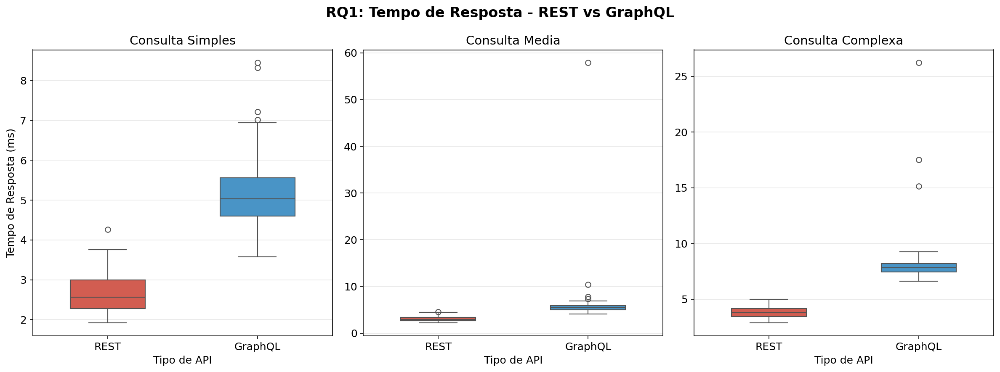
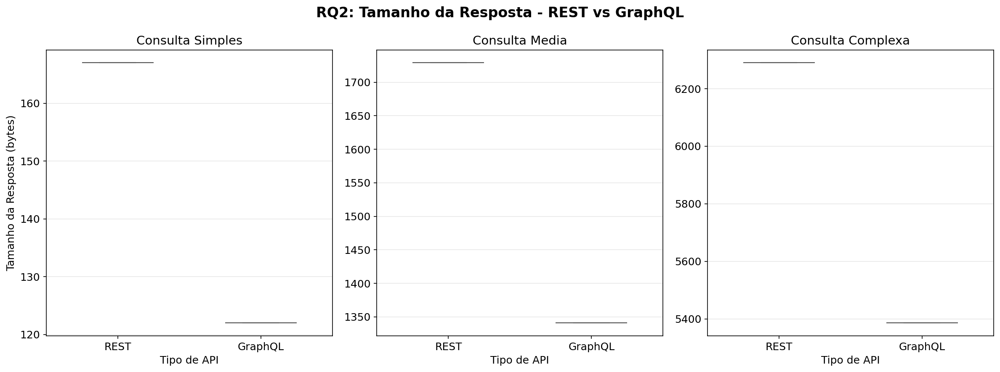
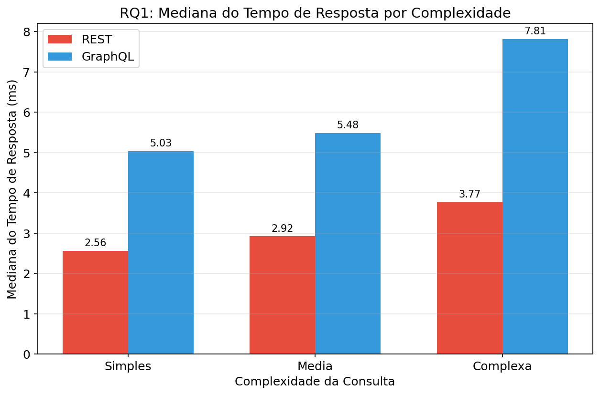
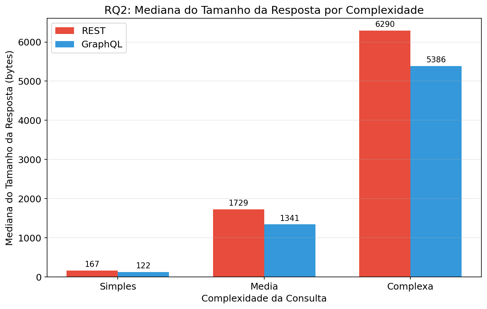
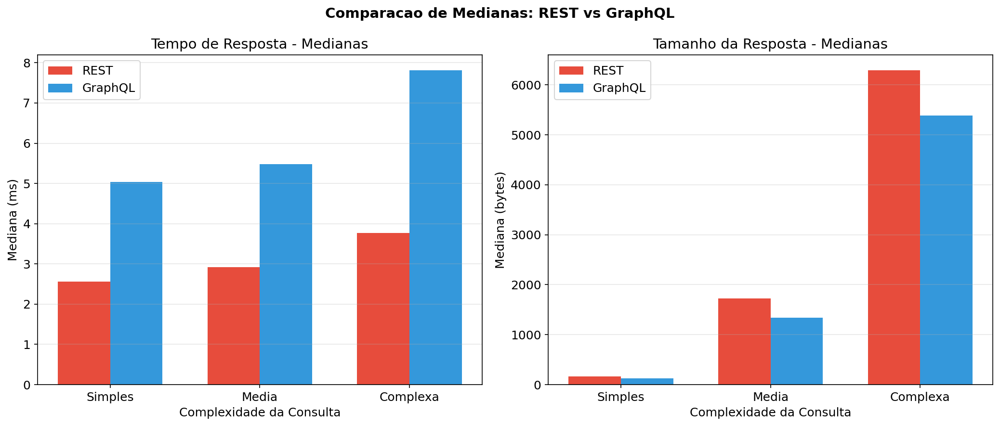
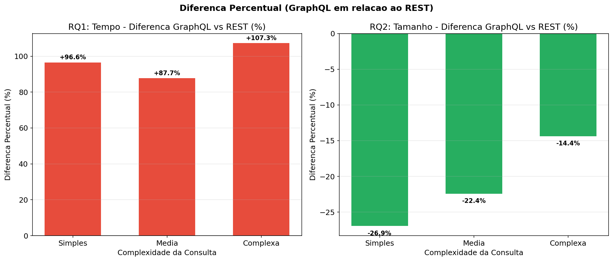
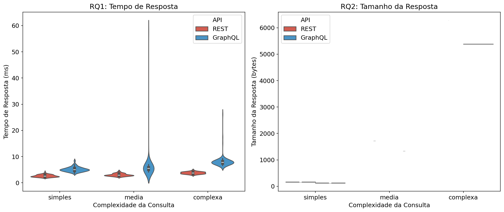
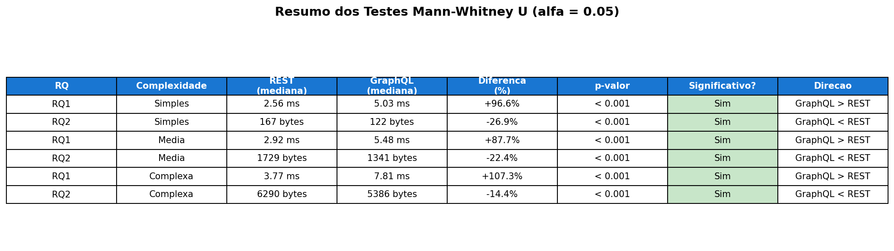

# Lab 05 — GraphQL vs REST: Um Experimento Controlado

## Integrantes

* Ana Luiza Santos Gomes
* Bruna Barbosa Portilho Bernardes Campidelli
* Walter Roberto Rodrigues Louback

---

# 1. Introducao

A linguagem de consulta GraphQL, proposta pelo Facebook como metodologia de implementacao de APIs Web, representa uma alternativa as populares APIs REST. Baseada em grafos, a linguagem permite que usuarios consultem banco de dados na forma de schemas, de modo que se possa exportar a base e realizar consultas num formato definido pelo fornecedor da API. Por outro lado, APIs criadas com base em abordagens REST baseiam-se em endpoints: operacoes pre-definidas que podem ser chamadas por clientes que desejam consultar, deletar, atualizar ou escrever um dado na base.

Desde o surgimento do GraphQL, varios sistemas realizaram a migracao entre ambas as solucoes, mantendo solucoes compativeis REST, mas oferecendo os beneficios da nova linguagem de consulta proposta. Entretanto, nao esta claro quais os reais beneficios da adocao de uma API GraphQL em detrimento de uma API REST.

Nesse contexto, o objetivo deste laboratorio e realizar um experimento controlado para avaliar quantitativamente os beneficios da adocao de uma API GraphQL, respondendo as seguintes perguntas de pesquisa:

- **RQ1**: Respostas as consultas GraphQL sao mais rapidas que respostas as consultas REST?
- **RQ2**: Respostas as consultas GraphQL tem tamanho menor que respostas as consultas REST?

---

# 2. Metodologia

## 2.1 Desenho do Experimento

### Hipoteses

**RQ1 - Tempo de Resposta:**
- **H0**: Nao ha diferenca significativa no tempo de resposta entre GraphQL e REST.
- **H1**: As consultas GraphQL possuem tempo de resposta diferente das consultas REST.

**RQ2 - Tamanho da Resposta:**
- **H0**: Nao ha diferenca significativa no tamanho da resposta entre GraphQL e REST.
- **H1**: As respostas GraphQL possuem tamanho diferente das respostas REST.

### Variaveis

- **Variaveis Dependentes**: Tempo de resposta (ms) e Tamanho da resposta (bytes).
- **Variaveis Independentes**: Tipo de API (REST vs GraphQL) e Complexidade da consulta (simples, media, complexa).

### Tratamentos

| Tratamento | Tipo de API | Complexidade | Descricao |
|---|---|---|---|
| T1 | REST | Simples | Buscar um pais por ID |
| T2 | GraphQL | Simples | Buscar um pais por ID |
| T3 | REST | Media | Buscar paises por regiao (filtro) |
| T4 | GraphQL | Media | Buscar paises por regiao (filtro) |
| T5 | REST | Complexa | Buscar pais com cidades, linguas e universidades |
| T6 | GraphQL | Complexa | Buscar pais com cidades, linguas e universidades |

### Objetos Experimentais

API REST e GraphQL expostas pelo mesmo servidor (FastAPI), compartilhando o mesmo banco de dados SQLite com 50 paises, 567 cidades, 30 linguas, 170 relacoes pais-lingua e 1421 universidades.

### Tipo de Projeto Experimental

Experimento fatorial 2x3 (2 tipos de API x 3 niveis de complexidade), com medidas repetidas.

### Quantidade de Medicoes

100 repeticoes por tratamento, totalizando 600 medicoes, precedidas por 10 requisicoes de warmup para cada consulta.

### Ameacas a Validade

- **Interna**: Ambas as APIs rodam no mesmo servidor, eliminando variacao de infraestrutura. O warmup reduz efeitos de cache frio. As medicoes foram feitas em ambiente local, sem latencia de rede.
- **Externa**: O dataset sintetico pode nao representar cenarios reais de producao. O servidor local nao replica condicoes de carga e concorrencia de producao.
- **Construto**: O tempo medido inclui processamento do servidor e serializacao. Tamanhos de resposta sao determinados pelo schema e formato de serializacao.

## 2.2 Preparacao do Experimento

### Infraestrutura

- **Servidor**: FastAPI com Strawberry GraphQL, rodando em `localhost:8000`
- **Banco de Dados**: SQLite com 5 tabelas (countries, cities, languages, country_languages, universities)
- **Endpoints REST**: `/api/countries/{id}`, `/api/countries?region=X`, `/api/countries/{id}/details`
- **Endpoint GraphQL**: `/graphql` com queries equivalentes
- **Consultas equivalentes**: Cada consulta REST tem uma query GraphQL equivalente que retorna os mesmos dados

### Scripts

- `database.py`: Cria e popula o banco SQLite
- `server.py`: Servidor FastAPI com REST + GraphQL
- `run_experiment.py`: Executa as 600 medicoes (100 repeticoes x 6 tratamentos)
- `analyze.py`: Analise estatistica (Shapiro-Wilk, Mann-Whitney U)

## 2.3 Execucao do Experimento

O experimento foi executado em ambiente local com as seguintes condicoes:

- **Ambiente**: Python 3.14, Linux
- **Servidor**: FastAPI + Uvicorn na porta 8000
- **Warmup**: 10 requisicoes por consulta antes das medicoes
- **Medicao**: Tempo de resposta medido com `time.perf_counter()` (precisao de microssegundos)
- **Tamanho**: Medido pelo tamanho da resposta HTTP em bytes (`len(response.content)`)
- **Ordem**: Consultas executadas sequencialmente, sem concorrencia

---

# 3. Resultados

## 3.1 Estatisticas Descritivas

### RQ1 - Tempo de Resposta (ms)

| Complexidade | API | Media | Mediana | Desvio Padrao |
|---|---|---|---|---|
| Simples | REST | 2.665 | 2.560 | 0.478 |
| Simples | GraphQL | 5.149 | 5.032 | 0.906 |
| Media | REST | 3.054 | 2.920 | 0.522 |
| Media | GraphQL | 6.054 | 5.480 | 5.304 |
| Complexa | REST | 3.815 | 3.768 | 0.446 |
| Complexa | GraphQL | 8.180 | 7.811 | 2.259 |

### RQ2 - Tamanho da Resposta (bytes)

| Complexidade | API | Media | Mediana |
|---|---|---|---|
| Simples | REST | 167 | 167 |
| Simples | GraphQL | 122 | 122 |
| Media | REST | 1729 | 1729 |
| Media | GraphQL | 1341 | 1341 |
| Complexa | REST | 6290 | 6290 |
| Complexa | GraphQL | 5386 | 5386 |

## 3.2 Teste de Normalidade (Shapiro-Wilk)

Os dados de tempo de resposta nao seguem distribuicao normal na maioria dos casos (p < 0.05), justificando o uso de testes nao-parametricos (Mann-Whitney U).

## 3.3 Testes de Hipotese (Mann-Whitney U, alfa = 0.05)

### RQ1 - Tempo de Resposta

| Complexidade | REST (mediana) | GraphQL (mediana) | Diferenca (%) | p-valor | Significativo | Direcao |
|---|---|---|---|---|---|---|
| Simples | 2.560 ms | 5.032 ms | +96.56% | < 0.001 | Sim | GraphQL > REST |
| Media | 2.920 ms | 5.480 ms | +87.69% | < 0.001 | Sim | GraphQL > REST |
| Complexa | 3.768 ms | 7.811 ms | +107.30% | < 0.001 | Sim | GraphQL > REST |

### RQ2 - Tamanho da Resposta

| Complexidade | REST (mediana) | GraphQL (mediana) | Diferenca (%) | p-valor | Significativo | Direcao |
|---|---|---|---|---|---|---|
| Simples | 167 bytes | 122 bytes | -26.95% | < 0.001 | Sim | GraphQL < REST |
| Media | 1729 bytes | 1341 bytes | -22.44% | < 0.001 | Sim | GraphQL < REST |
| Complexa | 6290 bytes | 5386 bytes | -14.37% | < 0.001 | Sim | GraphQL < REST |

## 3.4 Visualizacoes

**Figura 1**: Boxplot do tempo de resposta para cada nivel de complexidade, comparando REST e GraphQL.

**Figura 2**: Boxplot do tamanho da resposta para cada nivel de complexidade, comparando REST e GraphQL.

**Figura 3**: Mediana do tempo de resposta por complexidade.

**Figura 4**: Mediana do tamanho da resposta por complexidade.

**Figura 5**: Comparacao de medianas REST vs GraphQL para tempo e tamanho.

**Figura 6**: Diferenca percentual de GraphQL em relacao ao REST.

**Figura 7**: Distribuicao (violin plot) do tempo e tamanho de resposta.

**Figura 8**: Heatmap de p-valores dos testes Mann-Whitney U.

---

# 4. Discussao

## RQ1: Respostas as consultas GraphQL sao mais rapidas que respostas as consultas REST?

**Resposta: NAO.** Em todos os niveis de complexidade, as consultas REST foram significativamente mais rapidas que as consultas GraphQL (p < 0.001):

- **Simples**: REST foi ~97% mais rapido (2.56ms vs 5.03ms)
- **Media**: REST foi ~88% mais rapido (2.92ms vs 5.48ms)
- **Complexa**: REST foi ~107% mais rapido (3.77ms vs 7.81ms)

O overhead do GraphQL (parsing da query, resolucao do schema, serializacao) e significativo em comparacao com a simplicidade de um endpoint REST. A vantagem do GraphQL em termos de latencia nao se confirma neste experimento. Na verdade, a diferenca tende a aumentar com a complexidade da consulta, sugerindo que o custo de processamento do GraphQL escala mais rapidamente que o do REST.

## RQ2: Respostas as consultas GraphQL tem tamanho menor que respostas as consultas REST?

**Resposta: SIM.** Em todos os niveis de complexidade, as respostas GraphQL foram significativamente menores que as respostas REST (p < 0.001):

- **Simples**: GraphQL 27% menor (122 vs 167 bytes)
- **Media**: GraphQL 22% menor (1341 vs 1729 bytes)
- **Complexa**: GraphQL 14% menor (5386 vs 6290 bytes)

Isso e esperado porque o GraphQL permite ao cliente solicitar apenas os campos necessarios, evitando dados redundantes. No entanto, a reducao percentual diminui com a complexidade da consulta, o que pode ser explicado pelo overhead do formato JSON do GraphQL (wrapping em `data` e nomes de campos).

## Insights

1. **Trade-off fundamental**: GraphQL oferece respostas menores (overfetching reduzido), mas com custo de maior tempo de processamento. REST e mais rapido, mas pode retornar dados desnecessarios.

2. **Efeito da complexidade**: A diferenca de tempo aumenta com a complexidade (97% -> 88% -> 107%), enquanto a diferenca de tamanho diminui (27% -> 22% -> 14%). Isso sugere que para consultas complexas, o overhead do GraphQL cresce mais que a economia de dados.

3. **Cenario controlado**: Em um ambiente de producao com latencia de rede, o menor tamanho das respostas GraphQL poderia compensar parcialmente o overhead de processamento, especialmente em conexoes lentas.

4. **Aplicabilidade**: A escolha entre REST e GraphQL depende do contexto. Para aplicacoes onde o uso de banda e critico (mobile, IoT), GraphQL pode ser vantajoso. Para aplicacoes onde a latencia e o fator principal, REST pode ser mais adequado.

---

# 5. Conclusao

O experimento controlado demonstrou que:

- **RQ1**: As respostas GraphQL **nao sao mais rapidas** que as respostas REST. Pelo contrario, REST foi consistentemente mais rapido em todos os niveis de complexidade testados, com diferencas estatisticamente significativas (p < 0.001).

- **RQ2**: As respostas GraphQL **tem tamanho menor** que as respostas REST, com diferencas estatisticamente significativas (p < 0.001) em todos os niveis de complexidade.

Portanto, a adocao de GraphQL nao e benéfica em termos de velocidade de resposta, mas oferece vantagem na reducao do tamanho das respostas, evitando o overfetching tipico de APIs REST. A decisao entre REST e GraphQL deve considerar o trade-off entre latencia e eficiencia de dados.

---

# Ferramentas Utilizadas

* Python 3.14
* FastAPI + Uvicorn (servidor web)
* Strawberry GraphQL (API GraphQL)
* SQLite (banco de dados)
* Requests (cliente HTTP)
* Pandas, NumPy, SciPy (analise de dados)
* Matplotlib, Seaborn (visualizacao)
* Streamlit (dashboard interativo)